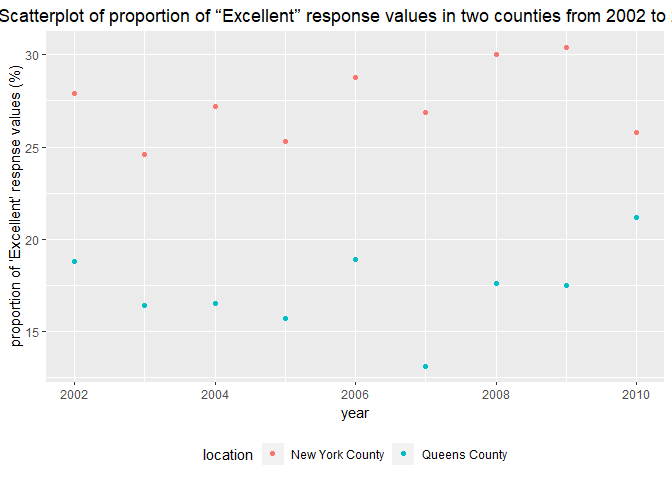

p8105\_hw2\_jy2944
================
Jie Yu
2018-10-01

-   [Problem 1](#problem-1)
    -   [Data import and initial cleaning](#data-import-and-initial-cleaning)
    -   [Some answers based on the data](#some-answers-based-on-the-data)
    -   [Reformat the data](#reformat-the-data)
-   [Problem 2](#problem-2)
    -   [Mr. Trash Wheel sheet](#mr.-trash-wheel-sheet)
    -   [Precipitation data for 2016 and 2017](#precipitation-data-for-2016-and-2017)
    -   [Desription about these data](#desription-about-these-data)
-   [Problem 3](#problem-3)
    -   [Import and tidy data](#import-and-tidy-data)
    -   [Some answers based on the data](#some-answers-based-on-the-data-1)

Problem 1
=========

The problem focuses on NYC Transit data.

### Data import and initial cleaning

``` r
# import data
transit_data = read_csv(file = "./data/NYC_Transit_Subway_Entrance_And_Exit_Data.csv") %>%
  # clean names of the data frame
  janitor::clean_names() %>%  
  # select variables
  select(line:route11, entry, vending, entrance_type, ada) %>%
  # convert the variable entry from character to logical 
  mutate(entry = recode(entry, "YES" = TRUE, "NO" = FALSE))
```

The above data frame `transit_data` contains 19 variables, which are line, station name, station latitude, station longitude, route served (route 1 to 11), entry, vending, entrance type, and ADA compliance (variable name "ada").

So far, I have cleaned names of the imported data frame, extracted the 19 variables which I need from the original dataset as well as placed the last 4 variables in a order that I want, and converted the variable entry from character (`YES` vs `NO`) to logical variable (`TRUE` vs `FALSE`).

The dimension of the resulting dataset is 1868 x 19.

Current data ar not tidy. The route variable is spread across eleven columns, which correspond to 11 routes. We need to fix that to make ourselves have only two columns for variable route: one for route number and one for route name.

### Some answers based on the data

-   There are 465 distinct stations.

-   84 distinct stations are ADA compliant.

-   The proportion of station entrances / exits without vending allow entrance is 0.3770492.

### Reformat the data

Then I reformat the data so that route number and route name are distinct variables.

``` r
transit_data = transit_data %>%
  # take the columns of variable route into key-value pairs.
  gather(key = "route_number", value = "route_name", route1:route11) %>%
  # split variable route_number into two columns
  separate(route_number, into = c("route_str", "route_number"), sep = 5) %>%
  # remove the variable route_str
  select(-route_str)
```

-   There are 60 distinct stations which serve the A train.

-   Of the stations that serve the A train, 17 stations are ADA compliant.

Problem 2
=========

This problem uses the Mr. Trash Wheel dataset.

### Mr. Trash Wheel sheet

First, let us import data from Mr. Trash Wheel sheet and make a cleaning.

``` r
# import data, specify the sheet and omit columns containing notes
trash_data = read_excel("./data/HealthyHarborWaterWheelTotals2018-7-28.xlsx", sheet = "Mr. Trash Wheel", range = "A2:N338") %>%
  # tidy names
  janitor::clean_names() %>%
  rename(weight = weight_tons, volume = volume_cubic_yards) %>%
  # omit rows that do not include dempster-specific data
  filter(!is.na(dumpster)) %>%
  # round sports_balls to the nearest integer and convert it to integer variable
  mutate(sports_balls = as.integer(round(sports_balls)))
```

### Precipitation data for 2016 and 2017

Next, let us import data from 2016 & 2017 Precipitation sheets and tidy the precipitation data.

``` r
# import precipitation data for 2016
precip_2016 = read_excel("./data/HealthyHarborWaterWheelTotals2018-7-28.xlsx", sheet = "2016 Precipitation", range = "A2:B15") %>%
  janitor::clean_names() %>%
  # omit rows without month-specific data
  filter(!is.na(month)) %>%
  # add variable year
  mutate(year = "2016")

# import precipitation data for 2017
precip_2017 = read_excel("./data/HealthyHarborWaterWheelTotals2018-7-28.xlsx", sheet = "2017 Precipitation", range = "A2:B15") %>%
  janitor::clean_names() %>%
  # omit rows without month-specific and precipitation-specific data
  filter(!is.na(month), !is.na(total)) %>%
  mutate(year = "2017")

# combine the dataset for 2016 and 2017
precipitation_data = bind_rows(precip_2016, precip_2017) %>%
  # convert month to a character variable
  mutate(month = c(month.name[1:12], month.name[1:12])) %>%
  # make the name much more specific
  rename(precipitation = total)
```

### Desription about these data

After the above steps, we got two resulting data frames, `trash_data` and `precipitation_data`.

Data frame `trash_data` contains information related to trash in a dumpster between May 2014 and August 2017. There is 285 observations and 14 in total. Variables include the weight and the volume of trash in each observed dumpster, as well as the numbers of specific types of trash such as plastic bottle, cigarette butts, and sports balls. Another interesting variable in this data frame is homes powered, which denotes the number of homes being powered by electricity generated from the trash in a dumpster.

-   The average weight of trash in a dumpster in year 2014, 2015, and 2016 are 3.21 tons, 3.36 tons, and 3.23 tons, respectively.
-   The volume range of trash in a dumpster in 2015 is 11 cubic yards.
-   The median number of sports balls in a dumpster in 2016 is 26.

Data frame `precipitation_data` contains information related to precipitation between January 2016 and December 2017. There is 24 observations and 3 in total. Variables indlude month, year, and precipitaion for each month.

-   The total precipitaion in 2017 is 32.93 inches.

Problem 3
=========

This problem uses the BRFSS data, and focus on the "Overall Health" topic.

### Import and tidy data

``` r
# download p8105.datasets
devtools::install_github("p8105/p8105.datasets")
library(p8105.datasets)
# load BRFSS data from p8105.datasets
data("brfss_smart2010")

brfss_data = brfss_smart2010 %>%
  janitor::clean_names() %>%
  # format the data to use appropriate variable names
  separate(locationdesc, into = c("state_str", "location"), sep = " - ") %>%
  select(-state_str) %>%
  rename(state_abbr = locationabbr) %>%
  # focus on "Overall Health" topic
  filter(topic == "Overall Health") %>%
  # select the variables which I need
  select(-(class:question),
         -sample_size, 
         -(confidence_limit_low:geo_location)) %>%
  # structure data so that responses are variables taking the value of data_value
  spread(key = response, value = data_value) %>%
  # clean the new variable names (5 response variables)
  janitor::clean_names() %>%
  # place the response variables in a low-to-high order
  select(year:location, poor, fair, good, very_good, excellent) %>%
  # create a new variable showing the proportion of respnses that were "excellent" of "very good" (above "good")
  mutate(above_good = very_good + excellent)
```

### Some answers based on the data

-   404 unique locations are included in the dataset. There are 51 unique state abbreviations in variable `state_abbr`, so every state is represented (50 states and the District of Columbia). NJ (New Jersey) is the most observed state.

-   In 2002, the median of the proportion of sujects with "Excellent" response value is 23.6%.

-   A histogram of "Excellent" response values in the year 2002.

``` r
brfss_data %>%
  filter(year == "2002") %>%
  ggplot(aes(x = excellent)) + 
  geom_histogram() +
  labs(title = "Histogram of 'Excellent' response values in year 2002", 
       x = "'Excellent' response values", 
       y = "Frequency") +
  theme(plot.title = element_text(hjust = 0.5)) 
```


-   Make a scatterplot showing the proportion of “Excellent” response values in New York County and Queens County in each year from 2002 to 2010.

``` r
brfss_data %>%
  filter(state_abbr == "NY") %>%
  filter(location == "New York County" | location == "Queens County") %>%
  ggplot(aes(x = year, y = excellent)) +
  geom_point(aes(color = location)) +
  labs(title = "Scatterplot of the proportion of “Excellent” response values in New York County and Queens County from 2002 to 2010",
       y = "proportion of 'Excellent' respnse values") +
  theme(plot.title = element_text(hjust = 0.5)) 
```


